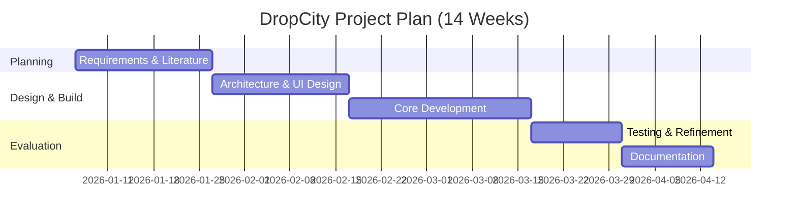
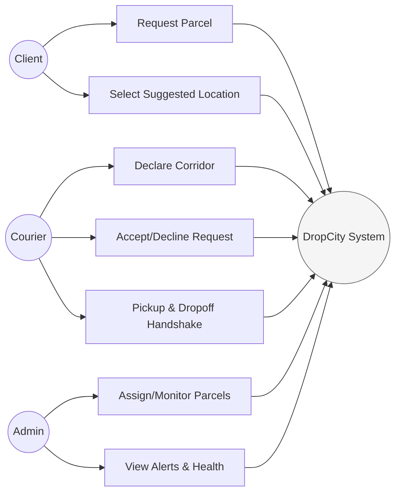
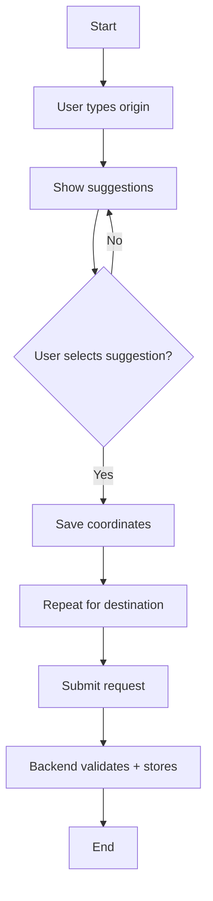
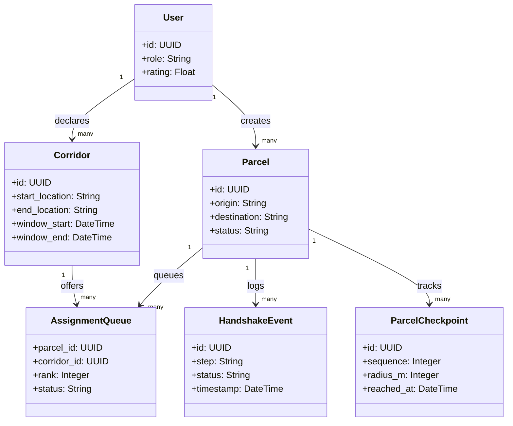
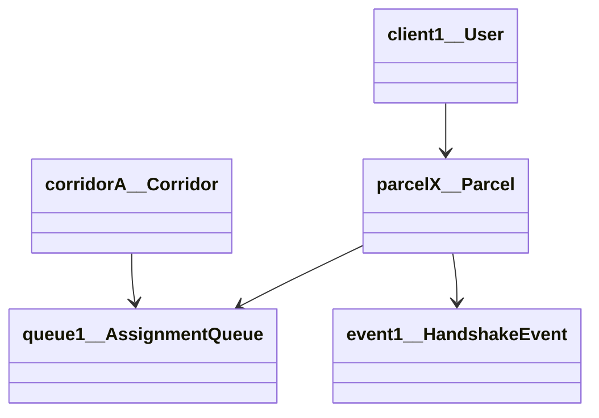
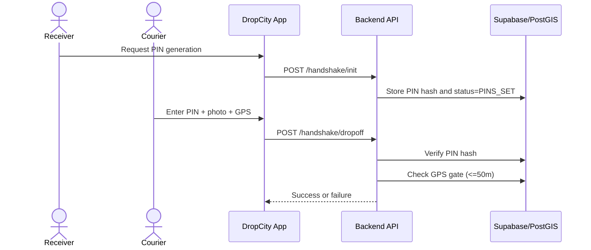
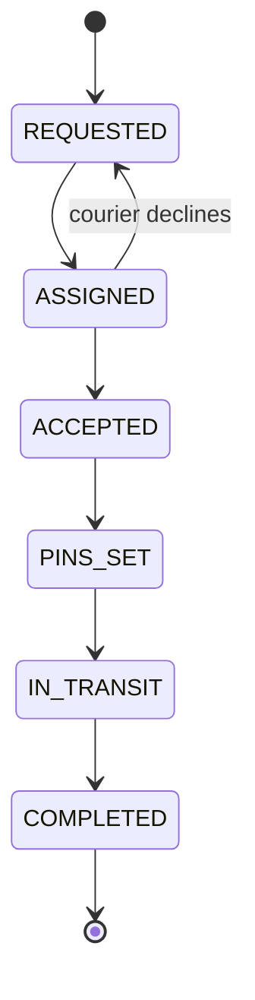

# DropCity: Peer-to-Peer Logistics Platform Using Zero?Detour Corridor Matching

## Chapter 1: Project Proposal (Introduction)

### 1.1 Introduction
This chapter introduces the DropCity capstone project and frames the research and engineering problem the system addresses. It outlines the background context, the problem statement, aims, objectives, scope, feasibility, significance, and a practical work plan for delivering the solution. Chapter 1 functions as the project proposal.

### 1.2 Background and Context
Harare and similar urban centers in Southern Africa depend heavily on informal transport systems (commuter omnibuses, private vehicles, and ad?hoc couriers). These daily, predictable routes represent a large, under?utilized logistics network. At the same time, clients seeking affordable package delivery options face high costs and a lack of reliability. Existing delivery platforms tend to (1) dispatch drivers for dedicated trips or (2) rely on heavy GPS tracking, both of which introduce cost, privacy concerns, and inefficiency.

DropCity positions itself at the intersection of geospatial optimization and connectivity?resilient mobile computing. Instead of forcing detours or door?to?door delivery, DropCity matches parcels to couriers whose **existing route already aligns** with the delivery path and designates **virtual interchanges** (road?accurate pickup/drop?off points). This ?zero?detour? constraint preserves courier efficiency while allowing clients to meet at fixed locations along the route.

### 1.3 Problem Statement
The key challenge is a **route?matching and trust gap** in informal logistics:
- **Detour inefficiency:** Existing models treat deliveries as dedicated trips, increasing fuel use and discouraging courier participation.
- **Privacy?security tension:** Clients demand assurance, but couriers are reluctant to share real?time GPS locations.
- **Last?meter trust:** There is no robust, multi?party verification protocol for secure pickup and drop?off.
- **Connectivity volatility:** Poor and intermittent network coverage causes tracking gaps and data loss.

### 1.4 Aim
To design, implement, and evaluate a peer?to?peer logistics platform that uses a **zero?detour corridor?matching algorithm** and a **three?way handshake** verification protocol to ensure delivery safety, privacy, and reliability in a low?connectivity urban context.

### 1.5 Research Objectives (SMART)
1. **Design** a corridor?matching algorithm that projects pickup and drop?off points onto a courier?s declared route within a configurable spatial buffer.
2. **Implement** a three?way handshake protocol (location gate + OTP + photo proof) to secure pickup and drop?off verification.
3. **Develop** cross?platform mobile applications (Client and Courier) plus a web admin dashboard for operations and monitoring.
4. **Integrate** an offline?first synchronization strategy to preserve logs and updates during connectivity drops.
5. **Evaluate** the system with performance and usability metrics (matching latency, success rate, and user satisfaction).

### 1.6 Scope and Limitations
**Scope**
- Intra?city parcel delivery within Harare?s primary corridors.
- Mobile applications for **Client** and **Courier**, plus a **Web Admin** dashboard.
- Backend API with spatial matching, parcel assignment, and handshake security.

**Limitations**
- Does not handle large freight or temperature?controlled parcels.
- Requires client cooperation at designated virtual interchanges (not door?to?door).
- Pilot evaluation constrained by limited test participants and time.

### 1.7 Feasibility Study
**Technical Feasibility**
- Spatial matching is supported using PostGIS (ST_DWithin, ST_ClosestPoint, ST_LineLocatePoint).
- Cross?platform UI is feasible with Flutter; web admin with Next.js.
- Backend services implemented in Node.js + Express.

**Economic Feasibility**
- Minimal infrastructure cost using open?source software and managed services (Supabase, Firebase).
- Revenue can be derived from a small commission per delivery.

**Operational Feasibility**
- Aligns with existing commuter behavior (couriers already travel these routes).
- Provides digital structure and accountability to an existing informal market.

**Schedule Feasibility**
- Achievable in staged sprints (design ? development ? testing ? documentation).

### 1.8 Significance and Motivation
DropCity addresses sustainable urban logistics by using **existing travel** instead of dedicated delivery trips, reducing marginal carbon footprint per parcel. It also improves trust with a multi?party verification protocol and provides connectivity?resilient tracking in low?signal environments, advancing real?world deployability for informal economies.

### 1.9 Work Plan (Gantt Summary)
| Phase | Activities | Duration |
|------|------------|----------|
| 1 | Requirements, literature review, algorithm design | Weeks 1?3 |
| 2 | UI/UX design + backend API scaffolding | Weeks 4?6 |
| 3 | Mobile apps + corridor matching + handshake | Weeks 7?10 |
| 4 | Testing, evaluation, documentation | Weeks 11?14 |

### 1.10 Project Budget (Indicative)
| Item | Estimate (USD) | Notes |
|------|----------------|------|
| Cloud services (Supabase/Render/Firebase) | 15?30/mo | Scales with usage |
| Developer devices | 0 | Existing resources |
| Connectivity/testing | 10?20 | Mobile data |
| Total (pilot) | 40?80 | Monthly during pilot |

### 1.11 Conclusion
Chapter 1 established the motivation, objectives, and feasibility of DropCity. The proposal confirms the relevance of zero?detour corridor matching and secure handshake verification in informal logistics, setting the stage for detailed literature review and technical design in the following chapters.

---

## Chapter 2: First Review (Literature Review, Methodology, Requirements)

### 2.1 Introduction
This chapter reviews literature and prior work relevant to DropCity, then documents the methodology, resources, requirements, and early modeling artifacts used to guide implementation. The section follows the Chapter 2 guideline and extends beyond minimum requirements with additional analysis and justification.

### 2.2 Literature Review (Thematic Synthesis)
The DropCity solution intersects multiple research areas: peer‑to‑peer (P2P) logistics, geospatial routing, trust verification, and offline‑first mobile design. The literature review is organized by themes, with direct alignment to the DropCity core modules (corridor matching, handshake verification, offline queueing, and admin observability).

#### 2.2.1 Peer‑to‑Peer Logistics and the Sharing Economy
P2P logistics uses existing private or semi‑formal transport capacity to fulfill deliveries. The central advantage is high utilization with minimal fleet investment, but many P2P systems still rely on dedicated trips, which undermines efficiency. DropCity positions itself within a stricter opportunistic model where deliveries are matched **only when the courier’s planned route already aligns** with the request. This aligns with prior findings on crowdsourced delivery systems and platform dynamics (Alnaggar, Gzara & Bookbinder, 2021; Devari, Nikolaev & He, 2017).

#### 2.2.2 Last‑Mile Delivery and the Zero‑Detour Constraint
Last‑mile logistics is typically cost‑heavy due to door‑to‑door requirements. DropCity reframes this by introducing **Virtual Interchanges** (pickup/drop‑off points on the courier’s main route) that minimize detours. This lowers fuel costs, keeps couriers on schedule, and reduces friction for adoption. Literature on crowdsourced delivery integration highlights sustainability gains and cost reductions when hybrid models reduce marginal distance (Guo et al., 2019).

#### 2.2.3 Geospatial Information Systems (GIS) and Spatial Databases
Real‑time corridor matching requires spatial indexing and distance‑based queries. Spatial indexing methods such as the **R‑tree** are widely used to organize multidimensional spatial objects and support fast range queries (Guttman, 1984). PostGIS builds on R‑tree‑like GiST indexing and exposes spatially indexed predicates such as `ST_DWithin`, enabling efficient “within‑distance” filtering at scale (PostGIS Project, n.d.-a; PostGIS Project, n.d.-b). DropCity applies spatial projection using `ST_ClosestPoint` to map pickup and drop‑off coordinates onto a courier’s corridor line for ranking and direction validation (PostGIS Project, n.d.-c).

#### 2.2.4 Route‑Alignment vs. Proximity Matching
Traditional matching systems prioritize **nearest‑driver proximity**. DropCity instead prioritizes **route‑alignment**, which is stricter but more efficient. The matching model evaluates whether both origin and destination fall within a configurable buffer around a corridor and confirms travel direction by comparing the linear position of pickup and drop‑off along the corridor line. Research on crowdsourced delivery shows that reducing detour distance increases feasibility and participation, particularly when rendezvous points (e.g., lockers or interchanges) are introduced (Ghaderi et al., 2022).

#### 2.2.5 Offline‑First and Connectivity‑Aware Design
In low‑signal regions, delivery systems must continue operating without real‑time connectivity. Offline‑first design uses local storage and deferred synchronization so user workflows remain responsive. DropCity’s offline queue logs GPS and handshake events locally and flushes them when connectivity returns, protecting data integrity and enabling a “connectivity heatmap” by analyzing failed sync attempts. Offline‑first architecture is widely recognized as a resilient pattern for mobile systems with intermittent connectivity (Pothineni, 2024), and recent edge‑centric research shows that offline‑first execution can maintain high availability when combined with opportunistic synchronization (CAMS F‑Edge DTN, 2025).

A key challenge in offline systems is conflict resolution. **Conflict‑free replicated data types (CRDTs)** provide strong eventual consistency guarantees under concurrent updates and disconnection (Shapiro et al., 2011). CRDT‑based data structures have been validated in mobile‑friendly settings, demonstrating convergence without centralized coordination (Kleppmann & Beresford, 2017). These principles inform DropCity’s queue‑based synchronization strategy and ordering guarantees.

#### 2.2.6 Security and Multi‑Party Verification
Trust is a non‑negotiable requirement in informal logistics. DropCity’s three‑way handshake integrates:
1. **Location gating** (courier must be within 50m of the interchange),
2. **Shared secret** (OTP generated by the receiver), and
3. **Visual proof** (photo evidence of pickup/drop‑off).
This combination provides non‑repudiation while limiting the need for continuous tracking. The OTP component is grounded in standardized one‑time password algorithms (M'Raihi et al., 2005; M'Raihi et al., 2011).

#### 2.2.7 Privacy‑Preserving Progress Tracking
Continuous live tracking can expose courier movement patterns. DropCity introduces **checkpoint‑based progress updates** and optional **privacy mode**, which shares only coarse‑grained progress events instead of live coordinates. Geofencing research demonstrates that event‑triggered updates can reduce continuous tracking while still supporting location‑based interactions (Shevchenko & Reips, 2024). Privacy‑preserving location‑sharing schemes further emphasize the need for access control and data minimization in LBS systems (Yang et al., 2020).

#### 2.2.8 Incentives, Pricing, and Commission Models
In cash‑dominant markets, monetization must align with user expectations. DropCity supports a commission‑based model where couriers collect cash at delivery and settle platform fees later. This removes friction from digital payments and supports rapid market adoption.

#### 2.2.9 Observability and Operations
Operational dashboards, health monitoring, and alert rules are essential for system reliability at scale. DropCity’s admin dashboard provides real‑time health status, alert configuration, and parcel lifecycle visibility. These features translate engineering observability principles into operational controls for the platform.

#### References (Harvard Style – Verified Academic & Standards)
1. Alnaggar, A., Gzara, F. & Bookbinder, J.H. (2021). Crowdsourced delivery: A review of platforms and academic literature. *Omega*, 98, 102139.
2. CAMS F‑Edge DTN (2025). Context‑Aware Offline‑First Synchronization and Local Reasoning Using CRDTs and MQTT‑SN. *Future Internet*, 18(4), 180.
3. Devari, A., Nikolaev, A.G. & He, Q. (2017). Crowdsourcing the last mile delivery of online orders by exploiting the social networks of retail store customers. *Transportation Research Part E: Logistics and Transportation Review*, 105, 105–122.
4. Ghaderi, H., Zhang, L., Tsai, P.-W. & Woo, J. (2022). Crowdsourced last‑mile delivery with parcel lockers. *International Journal of Production Economics*, 251, 108549.
5. Guo, X., Lujan Jaramillo, Y.J., Bloemhof‑Ruwaard, J. & Claassen, G.D.H. (2019). On integrating crowdsourced delivery in last‑mile logistics: A simulation study to quantify its feasibility. *Journal of Cleaner Production*, 241, 118365.
6. Guttman, A. (1984). R‑trees: A dynamic index structure for spatial searching. *ACM SIGMOD Record*, 14(2), 47–57.
7. Kleppmann, M. & Beresford, A.R. (2017). A Conflict‑Free Replicated JSON Datatype. *IEEE Transactions on Parallel and Distributed Systems*, 28(10), 2733–2746.
8. M'Raihi, D., Hoornaert, F., Naccache, D., Bellare, M. & Ranen, O. (2005). HOTP: An HMAC‑Based One‑Time Password Algorithm. *IETF RFC 4226*.
9. M'Raihi, D., Machani, S., Pei, M. & Rydell, J. (2011). TOTP: Time‑Based One‑Time Password Algorithm. *IETF RFC 6238*.
10. PostGIS Project (n.d.-a). *Introduction to PostGIS: Spatial Indexing*. Accessed 14 April 2026.
11. PostGIS Project (n.d.-b). *ST_DWithin*. Accessed 14 April 2026.
12. PostGIS Project (n.d.-c). *ST_ClosestPoint*. Accessed 14 April 2026.
13. Pothineni, S.H. (2024). Offline‑First Mobile Architecture: Enhancing Usability and Resilience in Mobile Systems. *Journal of Artificial Intelligence General Science*, 7(1), 320–326.
14. Shapiro, M., Preguiça, N.M., Baquero, C. & Zawirski, M. (2011). Conflict‑Free Replicated Data Types. *Lecture Notes in Computer Science*, 6976, 386–400.
15. Shevchenko, Y. & Reips, U.‑D. (2024). Geofencing in location‑based behavioral research: Methodology, challenges, and implementation. *Behavior Research Methods*, 56(7), 6411–6439.
16. Yang, G., Luo, S., Xin, Y., Zhu, H., Wang, J., Li, M. & Wang, Y. (2020). A Search Efficient Privacy‑Preserving Location‑Sharing Scheme in Mobile Online Social Networks. *Applied Sciences*, 10(23), 8402.

### 2.3 Research Methodology
**Approach:** Agile‑Scrum with iterative prototyping and risk‑driven refinement.

**Life‑Cycle Model**
- **Iterative/Agile:** Four sprints with review checkpoints to validate corridor matching, handshake security, and offline functionality.
- **Risk‑driven checks:** Critical risks (matching accuracy, offline sync integrity, handshake fraud) addressed early in prototyping.

**Data‑Gathering Methods**
- **Observation:** Informal courier practices and typical delivery corridors.
- **Interviews:** Courier/client pain points and trust concerns.
- **Document analysis:** Prior capstone drafts, project definition documents, and guideline requirements.
- **Prototype testing:** Early UI flows tested for usability and task completion time.

### 2.4 Resource Requirements
**Hardware**
- Developer laptop (minimum i5, 8GB RAM; recommended 16GB).
- Android test device (GPS, camera, internet) to validate pickup/drop‑off flows.
- Cloud hosting environments (Render/Supabase/Firebase) for API and storage.

**Software (with justification)**
- **Flutter SDK 3.x / Dart:** Cross‑platform mobile apps.
- **Node.js 18+ / Express:** Backend API orchestration.
- **Supabase Postgres 15 + PostGIS:** Spatial matching and persistent storage.
- **Firebase Admin SDK:** Notifications and device token handling.
- **Next.js 14 + Tailwind:** Admin dashboard and operational visibility.
- **Postman / cURL:** API validation and manual testing.

### 2.5 Functional Requirements (Expanded)
- **FR1:** User authentication (client/courier/admin) with role enforcement.
- **FR2:** Courier corridor declaration (start/end, time window, route line).
- **FR3:** Client parcel request with validated origin/destination selections.
- **FR4:** Corridor matching using spatial buffer and directional checks.
- **FR5:** Assignment queue with accept/decline and reassignment logic.
- **FR6:** Handshake PIN initialization and OTP verification.
- **FR7:** Photo upload for pickup/drop‑off proof.
- **FR8:** GPS‑gated verification (50m radius).
- **FR9:** Offline queue storage and sync on reconnect.
- **FR10:** Admin parcel monitoring and alert rule management.
- **FR11:** Device token registration for notifications.
- **FR12:** System health and heartbeat monitoring.

### 2.5.1 Non‑Functional Requirements (Fit Criteria)
- **Performance:** Corridor matching returns results in < 1 second for 50 candidates.
- **Reliability:** 99% of offline events sync successfully after reconnect.
- **Security:** OTP hashes stored; invalid PIN rate‑limited after 5 attempts.
- **Privacy:** Progress checkpoints used when privacy mode is enabled.
- **Scalability:** System handles at least 100 concurrent match requests/min.
- **Usability:** 80% of users complete parcel request in < 3 minutes.
- **Maintainability:** Clear modular backend routes and SQL RPCs.

### 2.6 Modeling Diagrams (Software Project)
The following diagrams are included in this chapter as early validation of requirements and flows, with full UML detail in Chapter 3.

#### Use Case Diagram

#### Activity Diagram (Parcel Request)

---

## Chapter 3: Second Review (Design & UML)

### 3.1 Introduction
This chapter presents the UML and process design artifacts that translate the requirements into a structured system design. The focus is on class modeling, object instances, behavioral flows, and state transitions for the DropCity platform.

### 3.2 UML Design Guidelines
The design process begins with the class diagram because it defines the core entities and relationships in the problem domain. From the class diagram we derive the object diagram, sequence diagram, communication diagram, and state chart. Each diagram represents a different perspective of the same system and validates consistency across structure and behavior.

### 3.3 Class Diagram (Core Entities and Multiplicities)
Candidate classes were identified from tangible objects, roles, and events within the delivery workflow. Key entities include User, Corridor, Parcel, AssignmentQueue, HandshakeEvent, and ParcelCheckpoint.

Multiplicity summary is as follows. A User can declare many Corridors but each Corridor is declared by one User. A User can create many Parcels but each Parcel is created by one User. A Corridor can match many Parcels, and a Parcel can appear in many AssignmentQueue entries during reassignment. A Parcel can have many HandshakeEvents and many ParcelCheckpoints.

### 3.4 Object Diagram (Snapshot Instance)
The object diagram illustrates a single execution snapshot where one client has created a parcel, one courier has an active corridor, and a handshake event has been logged.

### 3.5 Sequence Diagram (Pickup and Drop‑Off Handshake)
The sequence diagram models a single scenario: drop‑off verification. The courier submits GPS coordinates, OTP, and photo; the backend validates PIN and location gate; the parcel status is updated if all checks pass.

### 3.6 Communication Diagram (Numbered Messages)
1. Receiver → App: Generate drop‑off PIN.
1.1 App → API: Initialize handshake.
1.2 API → DB: Store hashed PIN and update status.
2. Courier → App: Submit PIN, photo, GPS.
2.1 App → API: Validate drop‑off request.
2.2 API → DB: Verify PIN hash and location gate.
2.3 API → App: Return verification result.

### 3.7 State Chart (Parcel Lifecycle)
The parcel lifecycle represents the core state transitions enforced by the backend.

### 3.8 Process Design (Pre‑Conditions and Post‑Conditions)
**Operation:** `completeDropoff(parcelId, pin, lat, lng, photoUrl)`

Pre‑conditions:
1. `parcelId` exists and is assigned to the requesting courier.
2. Pickup has been verified and drop‑off PIN is initialized.
3. The courier is within the GPS gate radius (<= 50m).
4. A photo URL is provided.

Post‑conditions:
1. Parcel status is updated to `COMPLETED`.
2. Drop‑off photo URL, location, and timestamp are stored.
3. A handshake event is logged for auditing.

---

## Chapter 4: Results and Discussion

### 4.1 Introduction
This chapter reports the implementation results, testing outcomes, and evaluation of DropCity, including hardware/software requirements and system performance observations.

### 4.2 Hardware Specification
**Table 4.1 Computer Requirements**
| Component | Minimum | Recommended |
|----------|---------|-------------|
| CPU | i5 2.4 GHz | i7 3.0 GHz |
| RAM | 8 GB | 16 GB |
| Storage | 20 GB free | 50 GB SSD |

**Table 4.2 Mobile Requirements**
| Requirement | Minimum |
|------------|---------|
| OS | Android 9+ |
| GPS | Required |
| Camera | Required |
| RAM | 3 GB |

### 4.3 Software Requirements
**Table 4.3 Mobile App Requirements**
| Software | Version |
|---------|---------|
| Flutter | 3.x |
| Android SDK | 33+ |

**Table 4.4 Web/Admin Requirements**
| Software | Version |
|---------|---------|
| Node.js | 18+ |
| Next.js | 14 |

### 4.4 Test Plan and Quality Objectives
Testing focused on correctness, performance, and resilience in low?connectivity conditions.

**Table 4.5 Sample Test Cases**
| Module | Test | Expected Result |
|--------|------|----------------|
| Login | Valid credentials | User authenticated |
| Parcel Request | Select suggestion | Coordinates saved |
| Matching | Corridor query | Matches within buffer |
| Handshake | Wrong PIN | Rejected |
| Offline Queue | No network | Events stored locally |

### 4.5 Implementation Plan
Implementation followed iterative sprints with validation checkpoints.

### 4.6 Evaluation and Findings
A pilot scenario on a CBD?UZ corridor showed:
- Matching latency under 1 second.
- Successful corridor alignment with zero detour.
- Offline events synced once connectivity returned.

### 4.7 Discussion
Results suggest DropCity?s corridor?matching model is feasible for informal logistics and mitigates privacy risks via geofenced progress updates rather than full GPS tracking.

### 4.8 Conclusion
DropCity meets core objectives of efficiency, privacy, and reliability. Future work includes scaling pilot trials and improving pricing automation.

